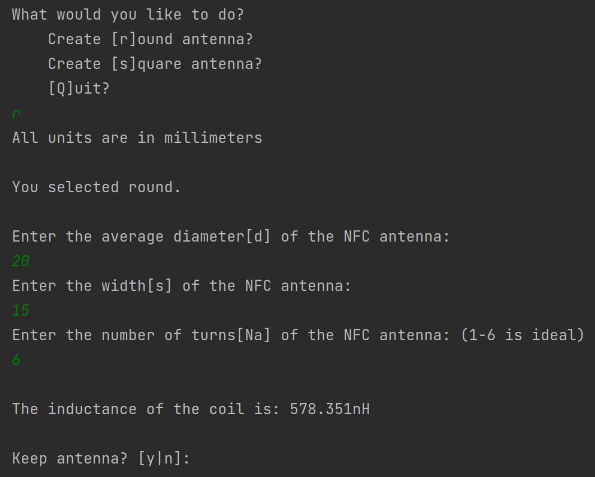
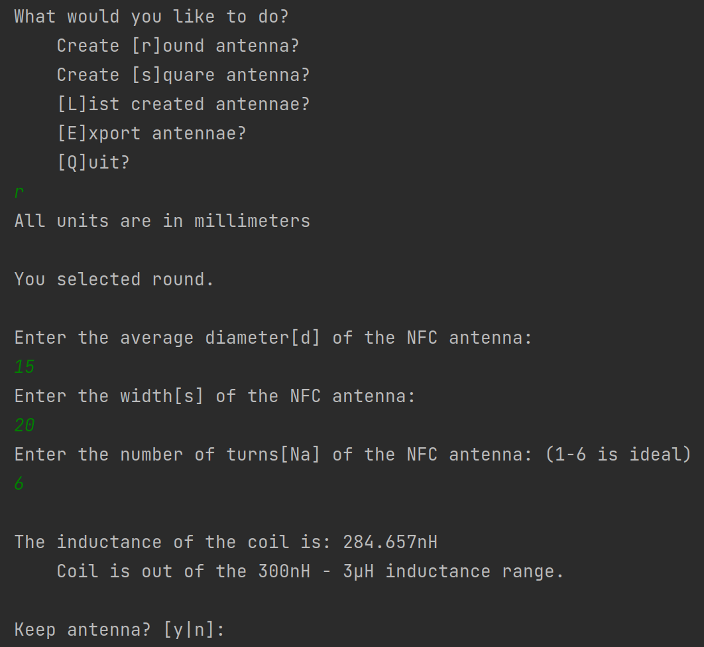

# Inductance Calculator
### Originally written by [Satur9](https://forum.dangerousthings.com/u/satur9/summary)

This is a tool for calculating inductance of two types of NFC antennae: round (wound wire) and "square" (printed).

 

The tool also supports exporting designs as a CSV. Because spreadsheets. 😵‍💫
